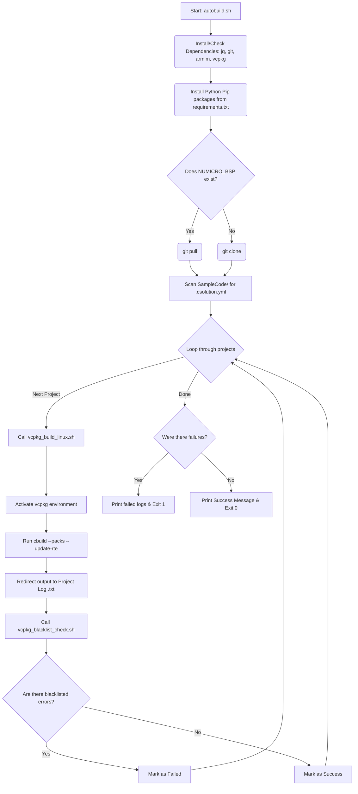

# Linux VSCode Build Subsystem for NuMicro BSP

[English](README.md) | [繁體中文](README_zh-TW.md)

This directory forms an automated Continuous Integration (CI) and local building toolchain orchestrator for NuMicro CMSIS-based projects specifically curated through VSCode (`.csolution.yml`). It automates the retrieval, preparation, verification, and compilation of the Nuvoton Board Support Package (BSP) projects on Linux platforms.

## Core Scripts & Files

### 1. `autobuild.sh`
This is your primary entry point and orchestrator script. When executed, it handles the following automatically:
- **Dependency Auto-Provisioning:** Dynamically detects and installs essential OS-level dependencies (`jq`, `git`, `python3`, `pip3`).
- **Toolchain Procurement:** Verifies, clones, and bootstraps Microsoft's `vcpkg` as well as Arm's official `armlm` license manager straight from origin if they are missing.
- **Arm License Enrollment:** Uses `armlm` to automatically activate/reactivate the `KEMDK-NUV1` commercial-use AC6 toolchain license.
- **Python Prerequisites:** Satisfies pip dependencies dictated within `requirements.txt` specifically needed by underlying build tools.
- **BSP Source Code Sync:** Intelligently checks if your specific Target Framework (e.g., `M3351BSP`) exists. If missing, it uses `git clone` to retrieve it, otherwise, it gracefully ensures it is up to date utilizing `git pull`.
- **Iterative Compilation & Analysis:** Hunts for every individual `.csolution.yml` file deep inside the BSP's `SampleCode` folder, cleanly fires off `vcpkg_build_linux.sh` for each, redirects the raw outcome into isolated log entries (`.txt`), sweeps the log aggressively leveraging `vcpkg_blacklist_check.sh`, flags results to standard output gracefully, and cleanly audits any compilation deviations at the very end.

### 2. `vcpkg_build_linux.sh`
The dedicated standalone context compiler invoked per individual CMSIS Solution project.
- **vcpkg Context Execution:** Explicitly activates the localized `vcpkg` build environment isolated exclusively to the toolchain contexts required to fetch configurations.
- **`cbuild` Context Mapping:** Seamlessly invokes the ARM `.csolution.yml` via the `cbuild list contexts` command to resolve compilation matrices and subsequently parses the context natively to build the code.
- Automatically handles the fetching and updating of missing CMSIS Packs (ex. `NuMicroM33_DFP`) and updates the Run-Time Environments implicitly via `--packs` and `--update-rte`.

### 3. `vcpkg_blacklist_check.sh`
A robust post-compilation log processor dedicated to catching forbidden CI syntax. 
- Analyzes unstructured verbose logs for fatal execution anomalies.
- Searches line-by-line natively targeting standard warnings and errors (e.g., `[Fatal Error]`, ` error: `, ` warning: `, `Warning[`).
- Annotates specific violation strings by meticulously tracing out directional arrows corresponding natively pointing to problematic logs, updating the finalized logfile physically, and generating a distinct exit code indicative of how many unique anomalies materialized to safely abort CI pipelines.

### 4. `requirements.txt`
A curated `pip` Python lockfile natively consumed early within the autobuilder orchestrator holding standard execution packages (`cbor`, `intelhex`, `ecdsa`, `cryptography`, `click`, etc.) required natively for cryptographic signing tools or supplemental post-build binaries in Nuvoton's ecosystem logic.

## Workflow Diagram



## Usage Guide
Run the orchestrator locally dynamically simply by executing:
```bash
./autobuild.sh
```
All intermediate project components and tooling environments will automatically deploy themselves in the background, rendering a hands-off local CI simulation perfectly mirroring GitHub Workflow mechanics.
