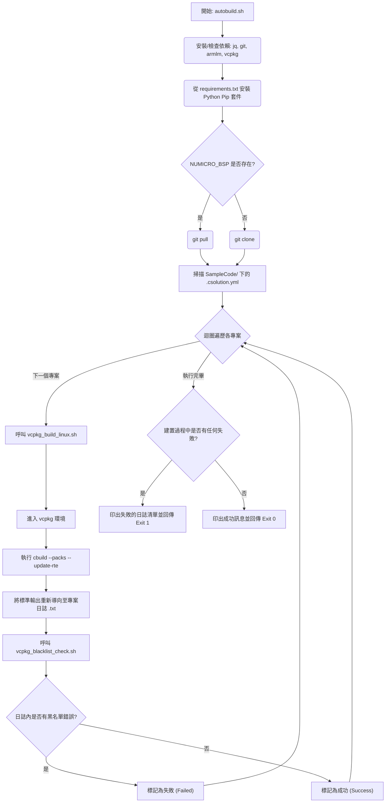

# Linux VCPKG Build Subsystem for NuMicro BSP

[English](README.md) | [繁體中文](README_zh-TW.md)

本目錄為 NuMicro 採用 CMSIS 架構且專為 VCPKG (`.csolution.yml`) 精心打造的專案，提供了一個自動化的持續整合 (CI) 與本地建置工具鏈協調程式。此工具可在 Linux 平台上自動完成 Nuvoton 板級支援包 (BSP) 專案的取得、準備、驗證及編譯。

## 核心腳本與檔案

### 1. `autobuild.sh`
這是您最主要的進入點與主要協調腳本。執行時，它會自動處理以下事項：
- **相依套件自動配置：** 動態偵測並安裝必備的作業系統層級相依套件 (`jq`, `git`, `python3`, `pip3`)。
- **取得工具鏈：** 若系統缺少微軟的 `vcpkg` 及 Arm 官方的 `armlm` 授權管理器，將會自動驗證、從來源節點複製並完成引導程式的建置。
- **Arm 授權登錄：** 使用 `armlm` 自動啟用/重新啟用 `KEMDK-NUV1` 商業用途之 AC6 工具鏈授權。
- **Python 必備套件：** 滿足底層建置工具在 `requirements.txt` 中所規範的 pip 套件需求。
- **BSP 原始碼同步：** 智慧地檢查您的特定目標框架 (例如 `M3351BSP`) 是否已經存在。若遺失，將使用 `git clone` 進行擷取；否則會透過 `git pull` 優雅地確保其在最新狀態。
- **迭代編譯與分析：** 在 BSP 的 `SampleCode` 資料夾深處尋找每一個獨立的 `.csolution.yml` 檔案，逐一為它們乾淨俐落地觸發 `vcpkg_build_linux.sh`，將原始結果導向至獨立的日誌記錄 (`.txt`) 中。接著，使用 `vcpkg_blacklist_check.sh` 積極地掃描日誌，將結果優雅地顯示於標準輸出中，並在最後乾淨地稽核所有的編譯異常。

### 2. `vcpkg_build_linux.sh`
每當遇到一個獨立的 CMSIS Solution 專案時，就會呼叫這支獨立且專責的背景編譯器腳本。
- **vcpkg 環境執行：** 針對取得配置時需要用到的工具鏈情境，明確地進入完全隔離的在地化 `vcpkg` 編譯環境中執行。
- **`cbuild` 情境對應：** 無縫地透過 `cbuild list contexts` 命令叫用 ARM `.csolution.yml`，以解析出所有的編譯矩陣排列，隨後用原生方式剖析情境並據此編譯程式碼。
- 透過 `--packs` 及 `--update-rte`，自動隱含地處理並更新遺失的 CMSIS 套件 (如 `NuMicroM33_DFP`) 以及運行時環境配置 (Run-Time Environments)。

### 3. `vcpkg_blacklist_check.sh`
一個強大、可於編譯完成後自動捕捉嚴禁出現於 CI 環境中之不良語法特徵的日誌處理程式。
- 分析未結構化且繁冗的日誌，以找出致命的執行異常。
- 透過逐行檢查、原生搜尋的方式，鎖定常見的警告與錯誤字串（如 `[Fatal Error]`、` error: `、` warning: `、`Warning[`）。
- 在標註特定的違規字串時，會精心計算並追蹤出對應的指向箭頭，並將箭頭指向出現問題的日誌處，同時實體更新並修改最後定稿的日誌檔案。最後產生一個獨特的結束代碼來反映究竟發生了幾次獨特的異常，藉此安全地中止 CI 流程的執行。

### 4. `requirements.txt`
一個精心整理過的 `pip` Python 鎖定檔。在自動建置協調程式執行的早期階段就會原生載入，其內部保存了 Nuvoton 生態邏輯底下，在執行密碼學簽章工具或是支援建置後輔助二進位檔時，所必須具備的標準執行套件 (`cbor`, `intelhex`, `ecdsa`, `cryptography`, `click` 等等)。

## 執行流程圖



## 使用指南
如果要在本地端以動態方式執行此協調程式，只需要簡單地執行以下命令：
```bash
./autobuild.sh
```
所有過渡的專案組件與工具環境都會自動在背景完成部署。為您帶來一個完全不需動手的本地 CI 模擬體驗，且能完美等同並反映 GitHub Workflow 的內部運作機制。
